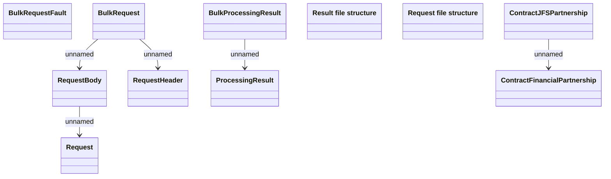

# Set financial partnership - File schema

```mermaid
classDiagram
    class RequestBody["RequestBody"]
    class RequestHeader["RequestHeader"]
    class BulkRequestFault["BulkRequestFault"]
    class BulkProcessingResult["BulkProcessingResult"]
    class BulkRequest["BulkRequest"]
    class ProcessingResult["ProcessingResult"]
    class Request["Request"]
    class Result_file_structure["Result file structure"]
    class Request_file_structure["Request file structure"]
    class ContractFinancialPartnership["ContractFinancialPartnership"]
    class ContractJFSPartnership["ContractJFSPartnership"]
    RequestBody --> Request : unnamed
    BulkRequest --> RequestHeader : unnamed
    BulkProcessingResult --> ProcessingResult : unnamed
    BulkRequest --> RequestBody : unnamed
    ContractJFSPartnership --> ContractFinancialPartnership : unnamed
```
