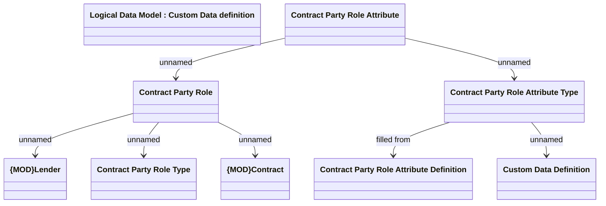

# Contract financial partnership - Logical data model

```mermaid
classDiagram
    class MOD_Lender["{MOD}Lender"]
    class Contract_Party_Role_Attribute_Type["Contract Party Role Attribute Type"]
    class Custom_Data_Definition["Custom Data Definition"]
    class Logical_Data_Model_Custom_Data_definition["Logical Data Model : Custom Data definition"]
    class Contract_Party_Role_Attribute_Definition["Contract Party Role Attribute Definition"]
    class Contract_Party_Role_Attribute["Contract Party Role Attribute"]
    class Contract_Party_Role_Type["Contract Party Role Type"]
    class Contract_Party_Role["Contract Party Role"]
    class MOD_Contract["{MOD}Contract"]
    Contract_Party_Role --> MOD_Lender : unnamed
    Contract_Party_Role_Attribute --> Contract_Party_Role : unnamed
    Contract_Party_Role --> Contract_Party_Role_Type : unnamed
    Contract_Party_Role_Attribute_Type --> Contract_Party_Role_Attribute_Definition : filled from
    Contract_Party_Role_Attribute_Type --> Custom_Data_Definition : unnamed
    Contract_Party_Role_Attribute --> Contract_Party_Role_Attribute_Type : unnamed
    Contract_Party_Role --> MOD_Contract : unnamed
```
