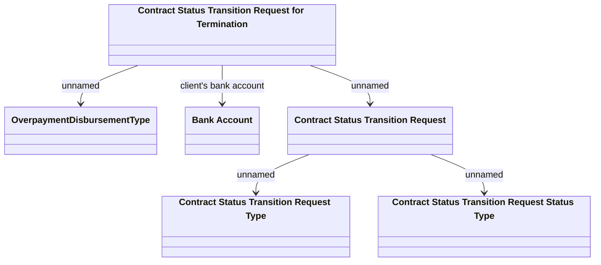

# Contract finishing - LDM

```mermaid
classDiagram
    class Contract_Status_Transition_Request_Type["Contract Status Transition Request Type"]
    class Contract_Status_Transition_Request_Status_Type["Contract Status Transition Request Status Type"]
    class OverpaymentDisbursementType["OverpaymentDisbursementType"]
    class Bank_Account["Bank Account"]
    class Contract_Status_Transition_Request["Contract Status Transition Request"]
    class Contract_Status_Transition_Request_for_Termination["Contract Status Transition Request for Termination"]
    Contract_Status_Transition_Request_for_Termination --> Contract_Status_Transition_Request : unnamed
    Contract_Status_Transition_Request_for_Termination --> Bank_Account : client's bank account
    Contract_Status_Transition_Request_for_Termination --> OverpaymentDisbursementType : unnamed
    Contract_Status_Transition_Request --> Contract_Status_Transition_Request_Type : unnamed
    Contract_Status_Transition_Request --> Contract_Status_Transition_Request_Status_Type : unnamed
```
