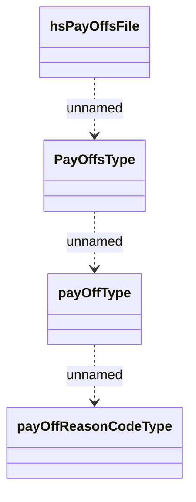

# PayOffs file structure

- **Diagram Type**: Logical
- **Package**: HomerSelect/BSL/Analysis Model/Contract Management/Contract pay-off/Interface/PayOffs
- **Diagram ID**: 62245
- **Elements**: 4
- **Connectors**: 3

