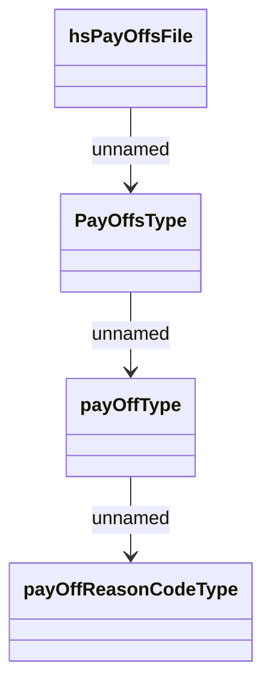

# PayOffs file structure

```mermaid
classDiagram
    class payOffReasonCodeType["payOffReasonCodeType"]
    class payOffType["payOffType"]
    class PayOffsType["PayOffsType"]
    class hsPayOffsFile["hsPayOffsFile"]
    hsPayOffsFile --> PayOffsType : unnamed
    PayOffsType --> payOffType : unnamed
    payOffType --> payOffReasonCodeType : unnamed
```
