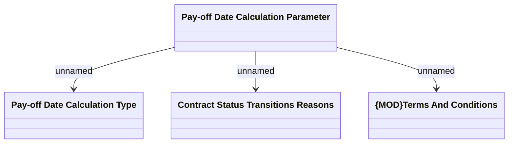

# Pay-off installment date 

```mermaid
classDiagram
    class Contract_Status_Transitions_Reasons["Contract Status Transitions Reasons"]
    class Pay_off_Date_Calculation_Type["Pay-off Date Calculation Type"]
    class Pay_off_Date_Calculation_Parameter["Pay-off Date Calculation Parameter"]
    class MOD_Terms_And_Conditions["{MOD}Terms And Conditions"]
    Pay_off_Date_Calculation_Parameter --> Pay_off_Date_Calculation_Type : unnamed
    Pay_off_Date_Calculation_Parameter --> Contract_Status_Transitions_Reasons : unnamed
    Pay_off_Date_Calculation_Parameter --> MOD_Terms_And_Conditions : unnamed
```
