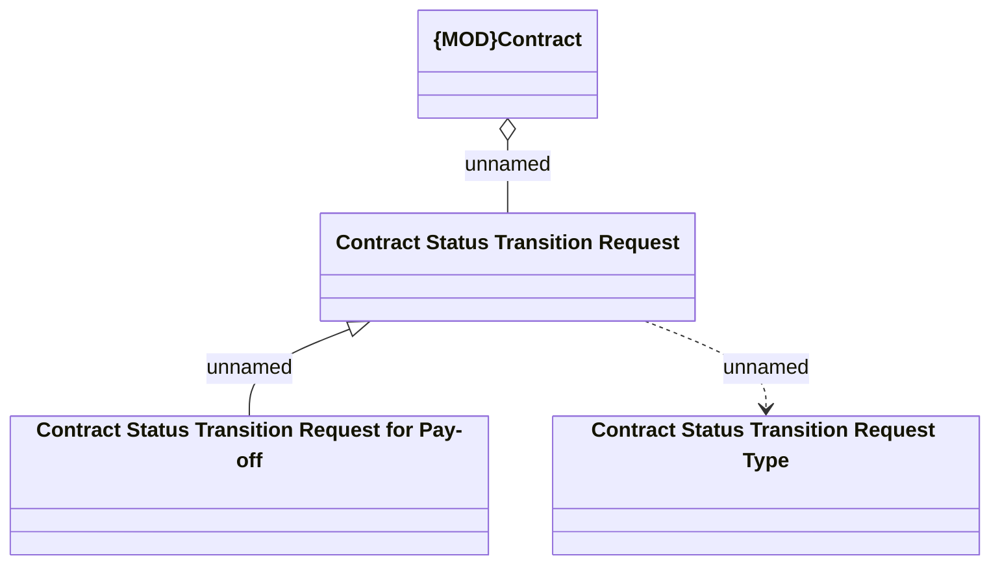

# Request for pay-off (REL)

- **Diagram Type**: Logical
- **Package**: HomerSelect/BSL/Analysis Model/Contract Management/Contract pay-off/Logical Data Model
- **Diagram ID**: 111367
- **Elements**: 4
- **Connectors**: 3

