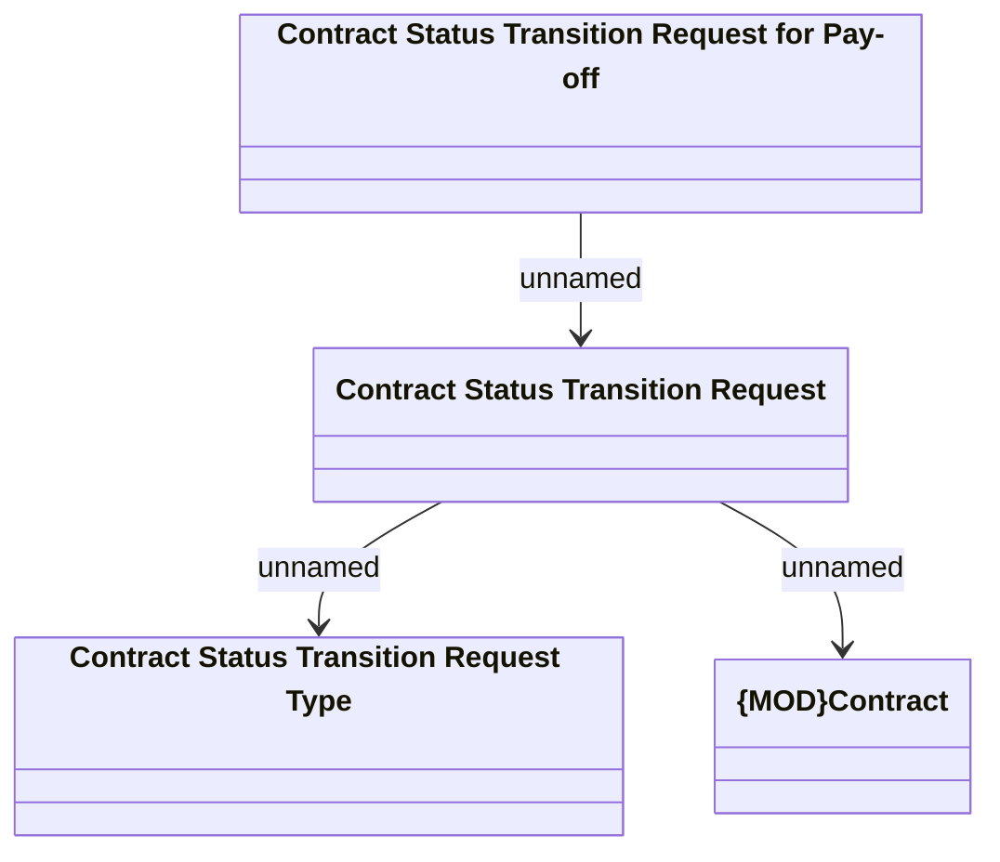

# Request for pay-off (REL)

```mermaid
classDiagram
    class Contract_Status_Transition_Request_Type["Contract Status Transition Request Type"]
    class MOD_Contract["{MOD}Contract"]
    class Contract_Status_Transition_Request_for_Pay_off["Contract Status Transition Request for Pay-off"]
    class Contract_Status_Transition_Request["Contract Status Transition Request"]
    Contract_Status_Transition_Request_for_Pay_off --> Contract_Status_Transition_Request : unnamed
    Contract_Status_Transition_Request --> Contract_Status_Transition_Request_Type : unnamed
    Contract_Status_Transition_Request --> MOD_Contract : unnamed
```
