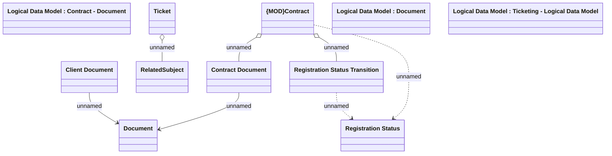

# Contract registration

- **Diagram Type**: Logical
- **Package**: HomerSelect/BSL/Analysis Model/Contract Management/Contract registration/Logical data model
- **Diagram ID**: 160758
- **Elements**: 11
- **Connectors**: 7

