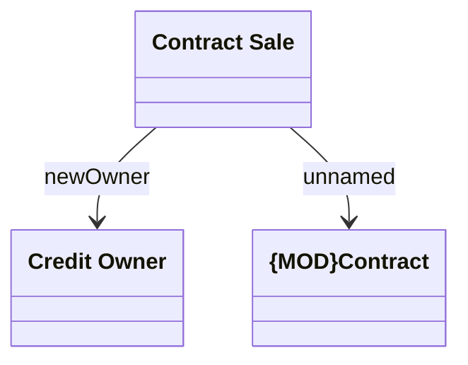

# Contract sale - Domain model

```mermaid
classDiagram
    class MOD_Contract["{MOD}Contract"]
    class Credit_Owner["Credit Owner"]
    class Contract_Sale["Contract Sale "]
    Contract_Sale --> Credit_Owner : newOwner
    Contract_Sale --> MOD_Contract : unnamed
```
