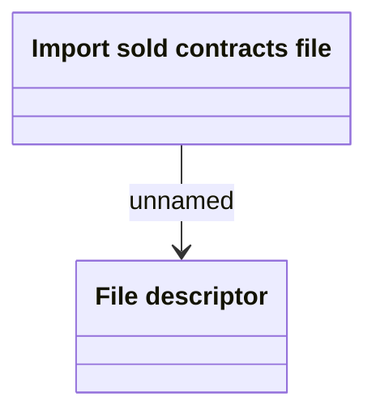

# Import sold contracts file - Domain model

- **Diagram Type**: Logical
- **Package**: HomerSelect/BSL/Analysis Model/Contract Management/Contract sale/Logical Data model
- **Diagram ID**: 161596
- **Elements**: 2
- **Connectors**: 1

