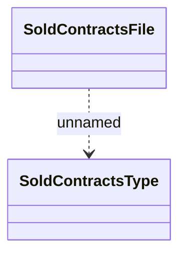

# Sold contract file

- **Diagram Type**: Logical
- **Package**: HomerSelect/BSL/Analysis Model/Contract Management/Contract sale/Logical Data model/Sold contract file
- **Diagram ID**: 116490
- **Elements**: 2
- **Connectors**: 1

