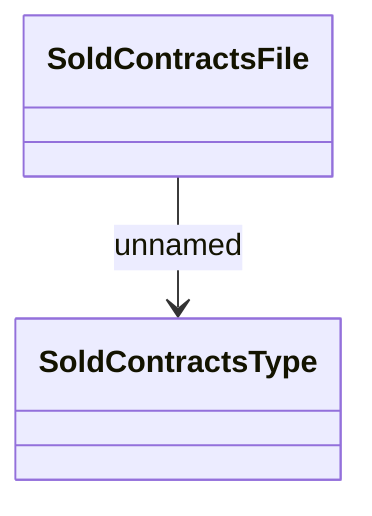

# Sold contract file

```mermaid
classDiagram
    class SoldContractsType["SoldContractsType"]
    class SoldContractsFile["SoldContractsFile"]
    SoldContractsFile --> SoldContractsType : unnamed
```
