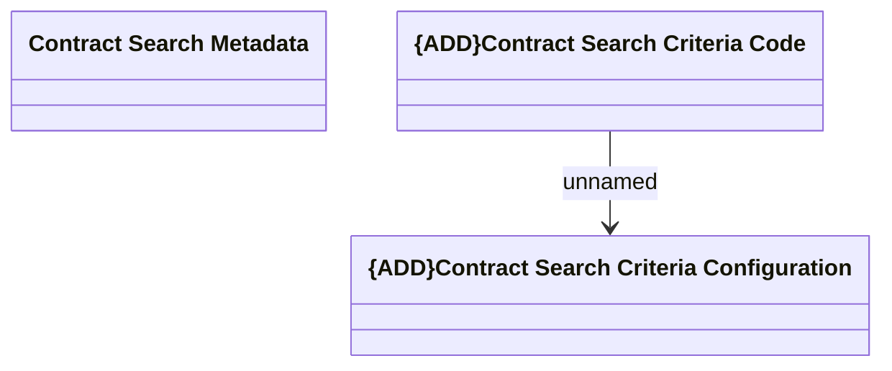

# Logical data model

- **Diagram Type**: Logical
- **Package**: HomerSelect/BSL/Analysis Model/Contract Management/Contract search/Logical data model
- **Diagram ID**: 135563
- **Elements**: 3
- **Connectors**: 1

