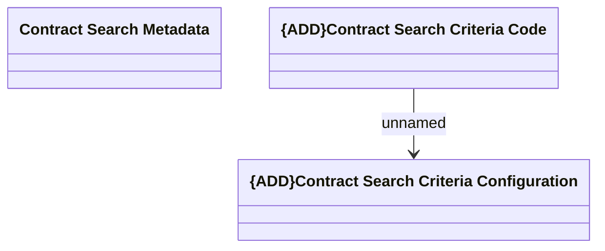

# Logical data model

```mermaid
classDiagram
    class Contract_Search_Metadata["Contract Search Metadata"]
    class ADD_Contract_Search_Criteria_Code["{ADD}Contract Search Criteria Code"]
    class ADD_Contract_Search_Criteria_Configuration["{ADD}Contract Search Criteria Configuration"]
    ADD_Contract_Search_Criteria_Code --> ADD_Contract_Search_Criteria_Configuration : unnamed
```
