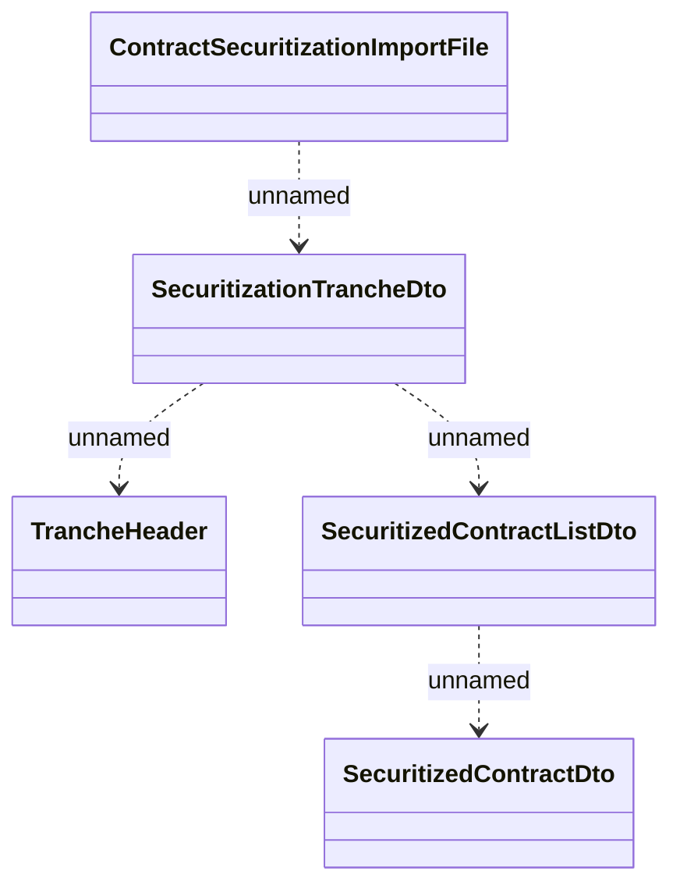

# Contract securitization - file structure 

- **Diagram Type**: Logical
- **Package**: HomerSelect/BSL/Analysis Model/Contract Management/Contract securitization/Interface model
- **Diagram ID**: 109358
- **Elements**: 5
- **Connectors**: 4

