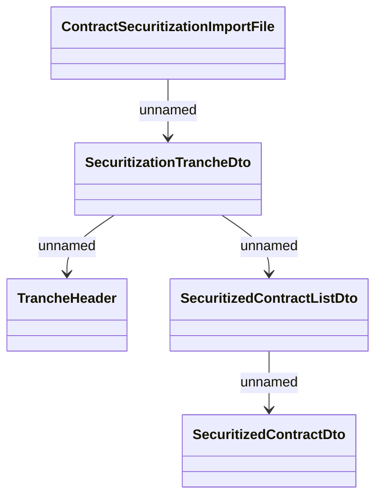

# Contract securitization - file structure 

```mermaid
classDiagram
    class TrancheHeader["TrancheHeader"]
    class SecuritizedContractDto["SecuritizedContractDto"]
    class SecuritizedContractListDto["SecuritizedContractListDto"]
    class SecuritizationTrancheDto["SecuritizationTrancheDto"]
    class ContractSecuritizationImportFile["ContractSecuritizationImportFile"]
    ContractSecuritizationImportFile --> SecuritizationTrancheDto : unnamed
    SecuritizationTrancheDto --> SecuritizedContractListDto : unnamed
    SecuritizedContractListDto --> SecuritizedContractDto : unnamed
    SecuritizationTrancheDto --> TrancheHeader : unnamed
```
