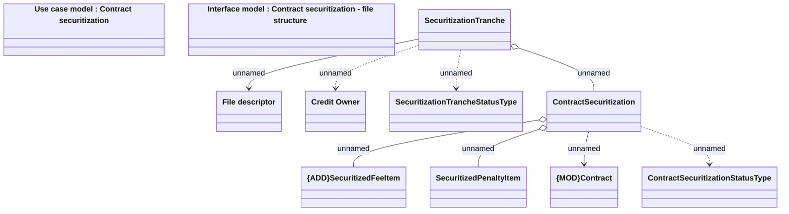

# Contract securitization - LDM

- **Diagram Type**: Logical
- **Package**: HomerSelect/BSL/Analysis Model/Contract Management/Contract securitization/Logical Data model
- **Diagram ID**: 116830
- **Elements**: 11
- **Connectors**: 8

