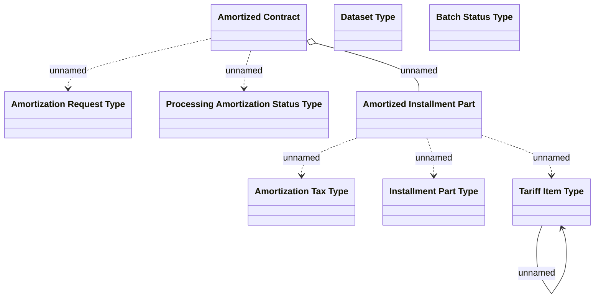

# Contract Write-off domain model

- **Diagram Type**: Logical
- **Package**: HomerSelect/BSL/Analysis Model/Contract Management/Contract write-off/Logical Data Model
- **Diagram ID**: 160363
- **Elements**: 9
- **Connectors**: 9

