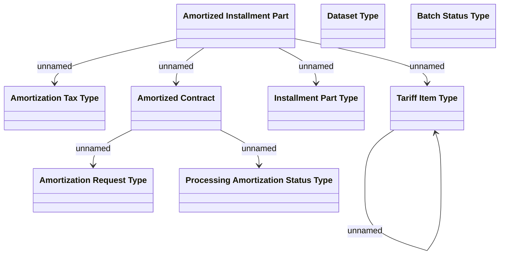

# Contract Write-off domain model

```mermaid
classDiagram
    class Amortization_Tax_Type["Amortization Tax Type"]
    class Amortized_Contract["Amortized Contract"]
    class Amortization_Request_Type["Amortization Request Type"]
    class Processing_Amortization_Status_Type["Processing Amortization Status Type"]
    class Installment_Part_Type["Installment Part Type"]
    class Tariff_Item_Type["Tariff Item Type"]
    class Amortized_Installment_Part["Amortized Installment Part"]
    class Dataset_Type["Dataset Type"]
    class Batch_Status_Type["Batch Status Type"]
    Amortized_Installment_Part --> Tariff_Item_Type : unnamed
    Amortized_Installment_Part --> Installment_Part_Type : unnamed
    Amortized_Contract --> Processing_Amortization_Status_Type : unnamed
    Amortized_Contract --> Amortization_Request_Type : unnamed
    Amortized_Installment_Part --> Amortized_Contract : unnamed
    Amortized_Installment_Part --> Amortization_Tax_Type : unnamed
    Tariff_Item_Type --> Tariff_Item_Type : unnamed
```
