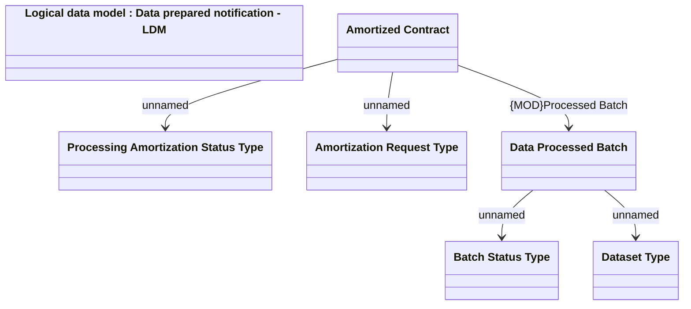

# Data for Write-off downloading from DWH - domain model (obsolete)

```mermaid
classDiagram
    class Logical_data_model_Data_prepared_notification_LDM["Logical data model : Data prepared notification - LDM"]
    class Processing_Amortization_Status_Type["Processing Amortization Status Type"]
    class Amortization_Request_Type["Amortization Request Type"]
    class Amortized_Contract["Amortized Contract"]
    class Dataset_Type["Dataset Type"]
    class Batch_Status_Type["Batch Status Type"]
    class Data_Processed_Batch["Data Processed Batch"]
    Amortized_Contract --> Data_Processed_Batch : {MOD}Processed Batch
    Data_Processed_Batch --> Batch_Status_Type : unnamed
    Data_Processed_Batch --> Dataset_Type : unnamed
    Amortized_Contract --> Amortization_Request_Type : unnamed
    Amortized_Contract --> Processing_Amortization_Status_Type : unnamed
```
