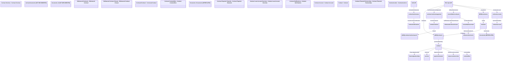

# CLM OpenAPI

```mermaid
classDiagram
    class Contract_Services_Contract_Services["Contract Services : Contract Services"]
    class services["services"]
    class ADD_communications_search["{ADD}communications/search"]
    class communications["communications"]
    class contractdocuments_NOT_IMPLEMENTED["contractdocuments (NOT IMPLEMENTED)"]
    class documents_v2_NOT_IMPLEMENTED["documents v2 (NOT IMPLEMENTED)"]
    class Refinanced_Contracts_Refinanced_Contract["Refinanced Contracts : Refinanced Contract"]
    class Refinanced_Contract_Closure_Refinanced_Contract_Closure["Refinanced Contract Closure : Refinanced Contract Closure"]
    class Contracts_Contract_Contracts_Contract["Contracts/Contract : Contracts/Contract"]
    class Contract_Commodities_Contract_Commodities["Contract Commodities : Contract Commodities"]
    class Documents_Documents_DEPRECATED["Documents :Documents (DEPRECATED)"]
    class Contract_Payment_Channels_Contract_Payment_Channels["Contract Payment Channels : Contract Payment Channels"]
    class Contract_Loan_Account_Overview_Contract_Loan_Account_Overvie["Contract Loan Account Overview : Contract Loan Account Overview"]
    class Contract_Notifications_Contract_Notifications["Contract Notifications : Contract Notifications"]
    class Contract_Account_Contract_Account["Contract Account : Contract Account"]
    class Contract_Contract["Contract : Contract"]
    class Contract_Financial_Partnerships_Contract_Financial_Partnersh["Contract Financial Partnerships : Contract Financial Partnerships"]
    class Communication_Communications["Communication : Communications"]
    class MOD_customers["(MOD)customers"]
    class refinancedcontracts["refinancedcontracts"]
    class refinancedcontractclosure["refinancedcontractclosure"]
    class customer["customer"]
    class contractnotifications["contractnotifications"]
    class contractmaintenance["contractmaintenance"]
    class contractaccount["contractaccount"]
    class contract["contract"]
    class communications["communications"]
    class communicationmanagement["communicationmanagement"]
    class CLM_API["CLM API"]
    class consolidationcontract["consolidationcontract"]
    class documents_DEPRECATED["documents (DEPRECATED)"]
    class consolidationcontracts["consolidationcontracts"]
    class financialpartnerships["financialpartnerships"]
    class contractaccounts["contractaccounts"]
    class loanaccountoverview["loanaccountoverview"]
    class paymentchannels["paymentchannels"]
    class commodities["commodities"]
    class MOD_contracts["(MOD)contracts"]
    class BSL_OpenAPI["BSL OpenAPI"]
    communications --> ADD_communications_search : /search
    contract --> financialpartnerships : /financialpartnership
    contract --> services : /services
    BSL_OpenAPI --> MOD_contracts : /contracts
    customer --> MOD_contracts : /contracts
    MOD_contracts --> contract : /{contractNumber}
    contract --> paymentchannels : /paymentchannels
    customer --> documents_DEPRECATED : /documents
    communicationmanagement --> communications : /communications
    BSL_OpenAPI --> communicationmanagement : /communicationmanagement
    consolidationcontracts --> refinancedcontractclosure : /setRefinancedContractClosure
    consolidationcontracts --> consolidationcontract : /{contractNumber}
    BSL_OpenAPI --> consolidationcontracts : /refinancedcontract
    MOD_customers --> customer : /{cuid}
    contractmaintenance --> contractnotifications : /resendcontractnotification
    CLM_API --> contractmaintenance : /contractmaintenance
    contract --> loanaccountoverview : /loanaccountoverviews
    contract --> commodities : /commodities
    BSL_OpenAPI --> MOD_customers : /customers
    consolidationcontract --> refinancedcontracts : /refinancedcontracts
    BSL_OpenAPI --> contractaccounts : /contractaccount
    contractaccounts --> contractaccount : /{contractNumber}
```
