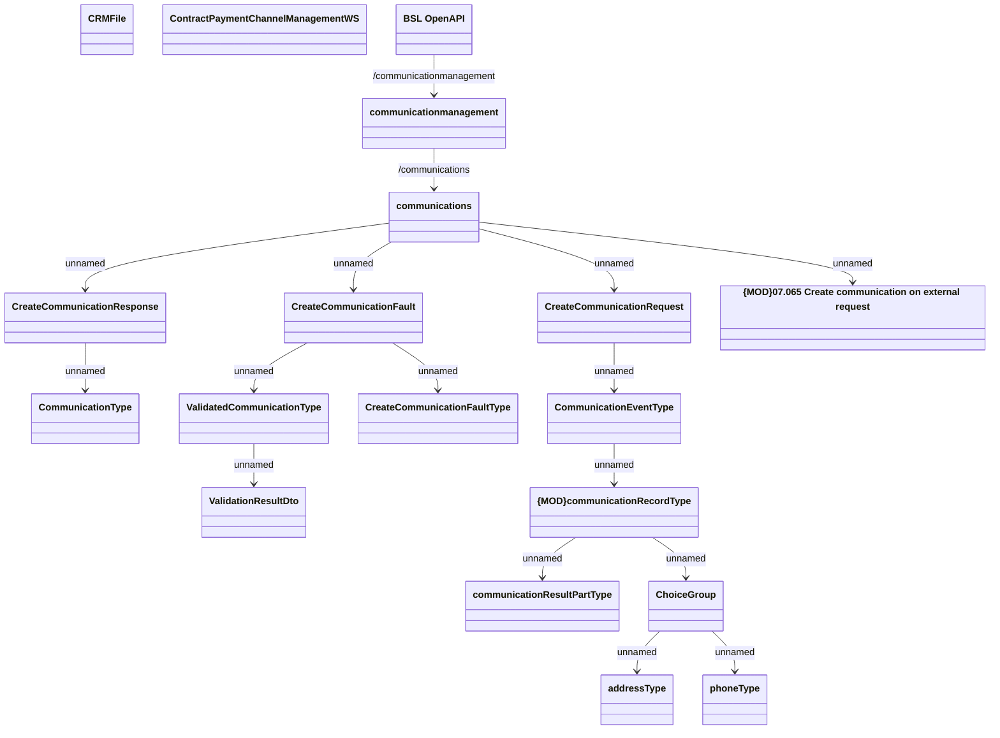

# Communications

```mermaid
classDiagram
    class ValidationResultDto["ValidationResultDto"]
    class ValidatedCommunicationType["ValidatedCommunicationType"]
    class CommunicationType["CommunicationType"]
    class CreateCommunicationFaultType["CreateCommunicationFaultType"]
    class CreateCommunicationFault["CreateCommunicationFault"]
    class MOD_07_065_Create_communication_on_external_request["{MOD}07.065 Create communication on external request"]
    class CommunicationEventType["CommunicationEventType"]
    class communicationResultPartType["communicationResultPartType"]
    class addressType["addressType"]
    class phoneType["phoneType"]
    class ChoiceGroup["ChoiceGroup"]
    class MOD_communicationRecordType["{MOD}communicationRecordType"]
    class CreateCommunicationResponse["CreateCommunicationResponse"]
    class CreateCommunicationRequest["CreateCommunicationRequest"]
    class CRMFile["CRMFile"]
    class ContractPaymentChannelManagementWS["ContractPaymentChannelManagementWS"]
    class communications["communications"]
    class BSL_OpenAPI["BSL OpenAPI"]
    class communicationmanagement["communicationmanagement"]
    ChoiceGroup --> addressType : unnamed
    CreateCommunicationFault --> ValidatedCommunicationType : unnamed
    CreateCommunicationResponse --> CommunicationType : unnamed
    CreateCommunicationFault --> CreateCommunicationFaultType : unnamed
    ValidatedCommunicationType --> ValidationResultDto : unnamed
    MOD_communicationRecordType --> communicationResultPartType : unnamed
    ChoiceGroup --> phoneType : unnamed
    MOD_communicationRecordType --> ChoiceGroup : unnamed
    CommunicationEventType --> MOD_communicationRecordType : unnamed
    CreateCommunicationRequest --> CommunicationEventType : unnamed
    communications --> CreateCommunicationResponse : unnamed
    communicationmanagement --> communications : /communications
    communications --> CreateCommunicationFault : unnamed
    communications --> CreateCommunicationRequest : unnamed
    BSL_OpenAPI --> communicationmanagement : /communicationmanagement
    communications --> MOD_07_065_Create_communication_on_external_request : unnamed
```
