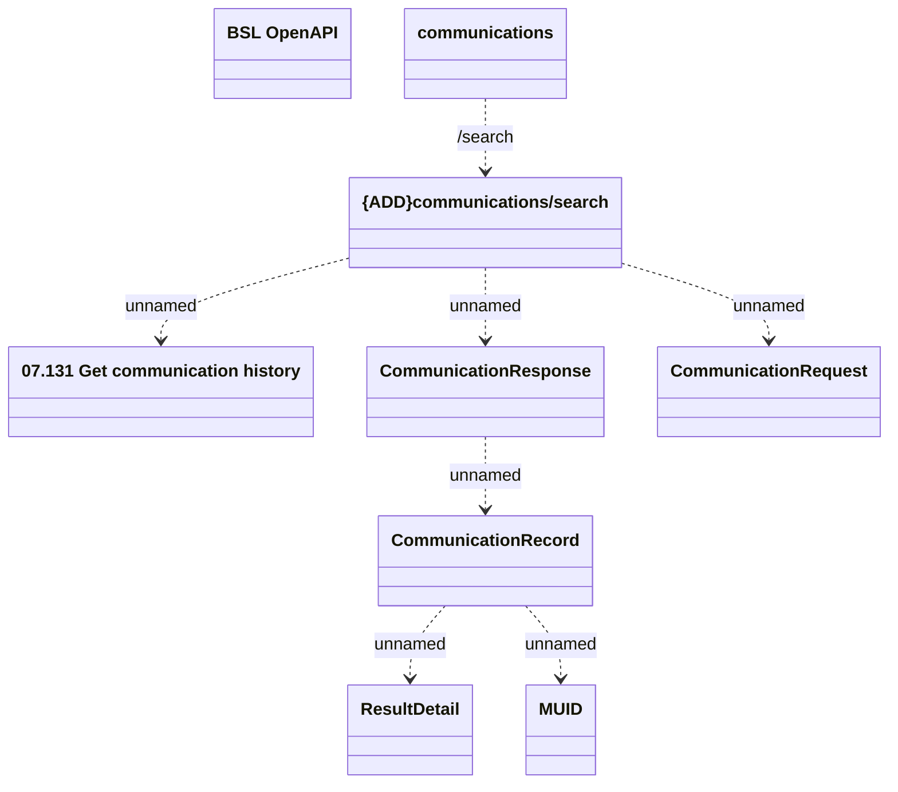

# Communications/Search

- **Diagram Type**: Logical
- **Package**: HomerSelect/BSL/Analysis Model/Contract Management/Customer Self-Care API/Application Interface Model/CLM OpenAPI/Communications/v1.0/Communications/Search
- **Diagram ID**: 159614
- **Elements**: 9
- **Connectors**: 7

