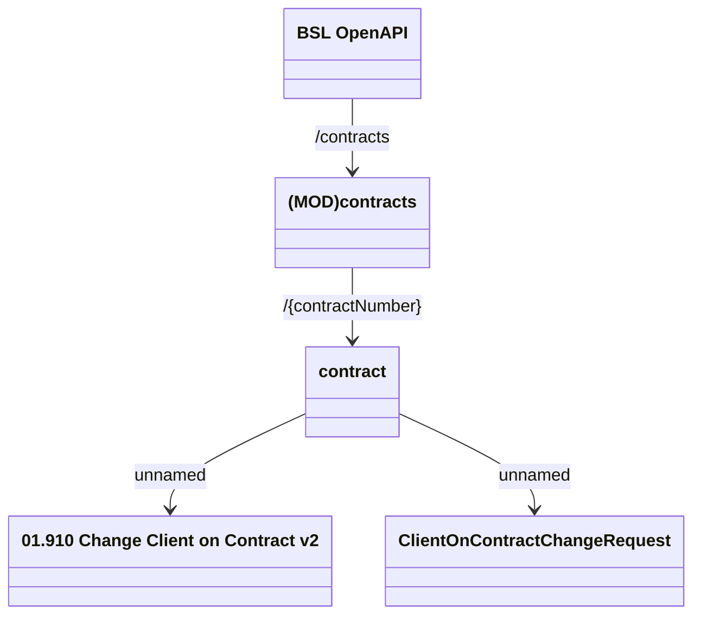

# Client on Contract change

```mermaid
classDiagram
    class n_01_910_Change_Client_on_Contract_v2["01.910 Change Client on Contract v2"]
    class ClientOnContractChangeRequest["ClientOnContractChangeRequest"]
    class MOD_contracts["(MOD)contracts"]
    class contract["contract"]
    class BSL_OpenAPI["BSL OpenAPI"]
    BSL_OpenAPI --> MOD_contracts : /contracts
    MOD_contracts --> contract : /{contractNumber}
    contract --> n_01_910_Change_Client_on_Contract_v2 : unnamed
    contract --> ClientOnContractChangeRequest : unnamed
```
