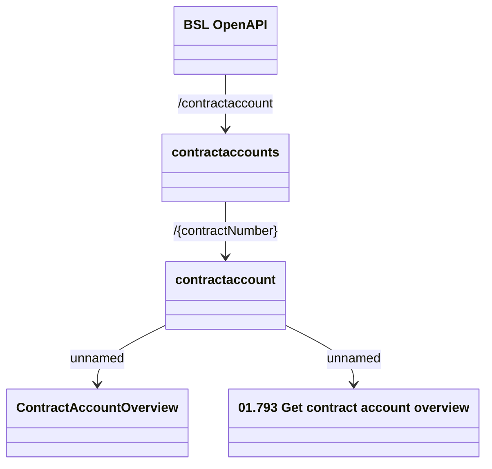

# Contract Account

```mermaid
classDiagram
    class contractaccount["contractaccount"]
    class contractaccounts["contractaccounts"]
    class BSL_OpenAPI["BSL OpenAPI"]
    class n_01_793_Get_contract_account_overview["01.793 Get contract account overview"]
    class ContractAccountOverview["ContractAccountOverview"]
    BSL_OpenAPI --> contractaccounts : /contractaccount
    contractaccounts --> contractaccount : /{contractNumber}
    contractaccount --> ContractAccountOverview : unnamed
    contractaccount --> n_01_793_Get_contract_account_overview : unnamed
```
