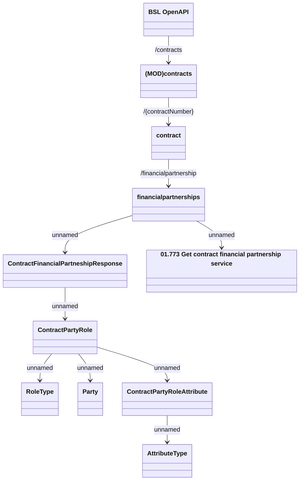

# Contract Financial Partnerships

```mermaid
classDiagram
    class financialpartnerships["financialpartnerships"]
    class MOD_contracts["(MOD)contracts"]
    class contract["contract"]
    class BSL_OpenAPI["BSL OpenAPI"]
    class AttributeType["AttributeType"]
    class RoleType["RoleType"]
    class Party["Party"]
    class ContractPartyRoleAttribute["ContractPartyRoleAttribute"]
    class ContractPartyRole["ContractPartyRole"]
    class ContractFinancialPartneshipResponse["ContractFinancialPartneshipResponse"]
    class n_01_773_Get_contract_financial_partnership_service["01.773 Get contract financial partnership service"]
    ContractFinancialPartneshipResponse --> ContractPartyRole : unnamed
    ContractPartyRole --> ContractPartyRoleAttribute : unnamed
    ContractPartyRole --> Party : unnamed
    ContractPartyRole --> RoleType : unnamed
    ContractPartyRoleAttribute --> AttributeType : unnamed
    contract --> financialpartnerships : /financialpartnership
    financialpartnerships --> ContractFinancialPartneshipResponse : unnamed
    BSL_OpenAPI --> MOD_contracts : /contracts
    MOD_contracts --> contract : /{contractNumber}
    financialpartnerships --> n_01_773_Get_contract_financial_partnership_service : unnamed
```
