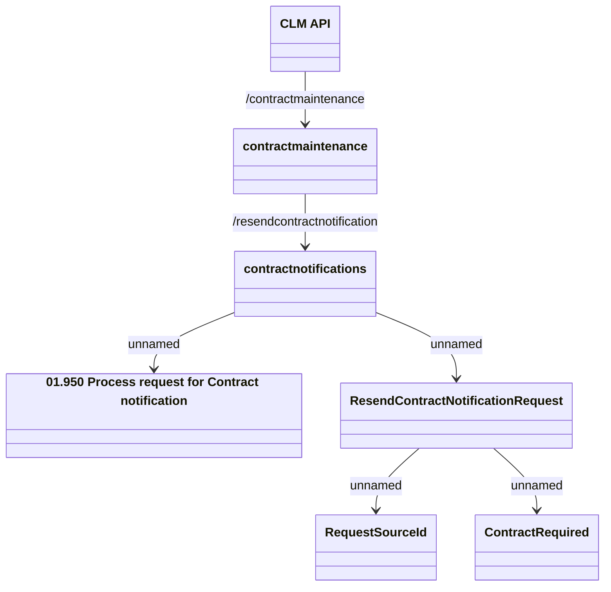

# Contract Notifications

```mermaid
classDiagram
    class contractnotifications["contractnotifications"]
    class contractmaintenance["contractmaintenance"]
    class CLM_API["CLM API"]
    class ContractRequired["ContractRequired"]
    class RequestSourceId["RequestSourceId"]
    class n_01_950_Process_request_for_Contract_notification["01.950 Process request for Contract notification"]
    class ResendContractNotificationRequest["ResendContractNotificationRequest"]
    ResendContractNotificationRequest --> RequestSourceId : unnamed
    ResendContractNotificationRequest --> ContractRequired : unnamed
    contractmaintenance --> contractnotifications : /resendcontractnotification
    CLM_API --> contractmaintenance : /contractmaintenance
    contractnotifications --> ResendContractNotificationRequest : unnamed
    contractnotifications --> n_01_950_Process_request_for_Contract_notification : unnamed
```
