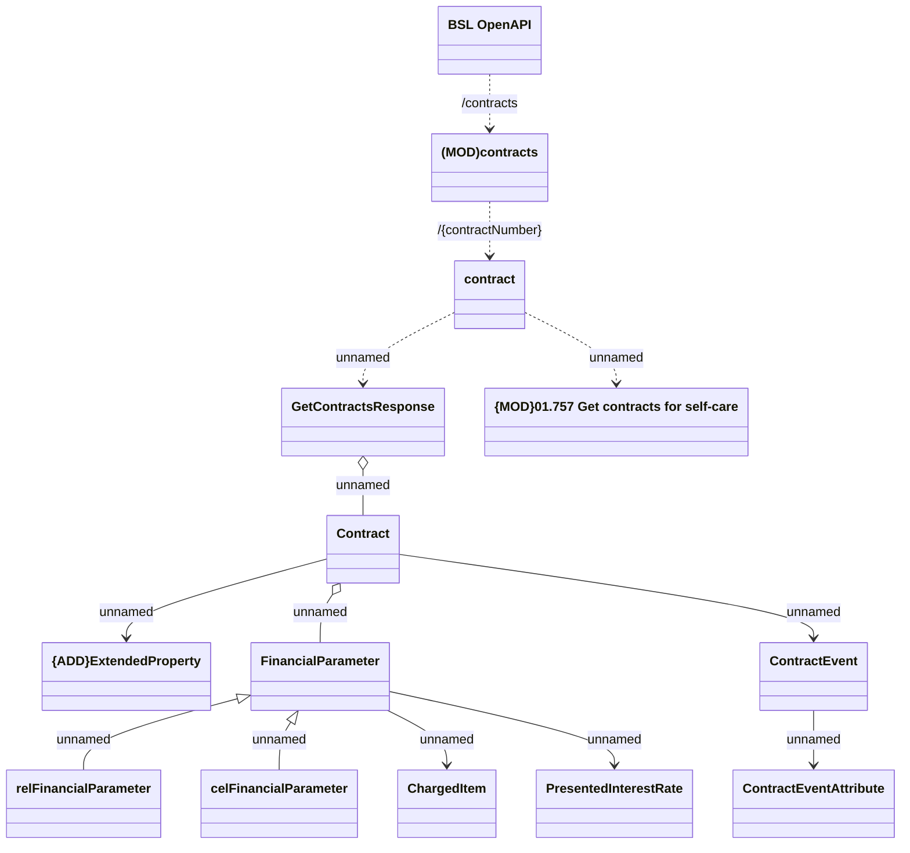

# Contract

- **Diagram Type**: Logical
- **Package**: HomerSelect/BSL/Analysis Model/Contract Management/Customer Self-Care API/Application Interface Model/CLM OpenAPI/Contracts/v10.0/Contract
- **Diagram ID**: 159613
- **Elements**: 14
- **Connectors**: 13

