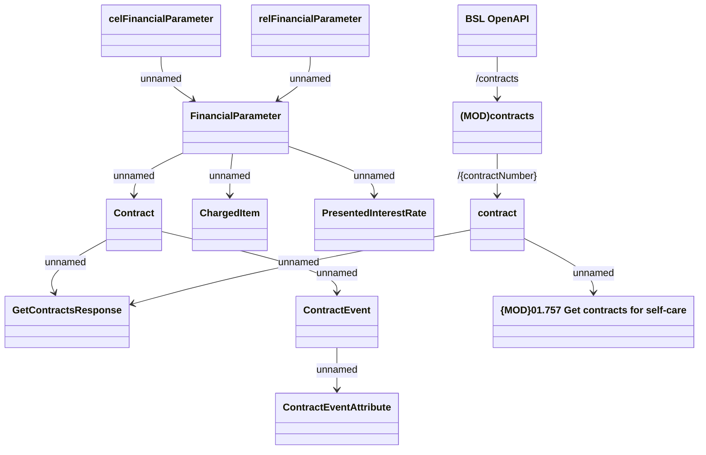

# Contract

```mermaid
classDiagram
    class MOD_contracts["(MOD)contracts"]
    class contract["contract"]
    class BSL_OpenAPI["BSL OpenAPI"]
    class ChargedItem["ChargedItem"]
    class FinancialParameter["FinancialParameter"]
    class relFinancialParameter["relFinancialParameter"]
    class GetContractsResponse["GetContractsResponse"]
    class PresentedInterestRate["PresentedInterestRate"]
    class ContractEventAttribute["ContractEventAttribute"]
    class celFinancialParameter["celFinancialParameter"]
    class Contract["Contract"]
    class ContractEvent["ContractEvent"]
    class MOD_01_757_Get_contracts_for_self_care["{MOD}01.757 Get contracts for self-care"]
    Contract --> ContractEvent : unnamed
    FinancialParameter --> Contract : unnamed
    ContractEvent --> ContractEventAttribute : unnamed
    FinancialParameter --> PresentedInterestRate : unnamed
    Contract --> GetContractsResponse : unnamed
    celFinancialParameter --> FinancialParameter : unnamed
    relFinancialParameter --> FinancialParameter : unnamed
    FinancialParameter --> ChargedItem : unnamed
    BSL_OpenAPI --> MOD_contracts : /contracts
    MOD_contracts --> contract : /{contractNumber}
    contract --> MOD_01_757_Get_contracts_for_self_care : unnamed
    contract --> GetContractsResponse : unnamed
```
