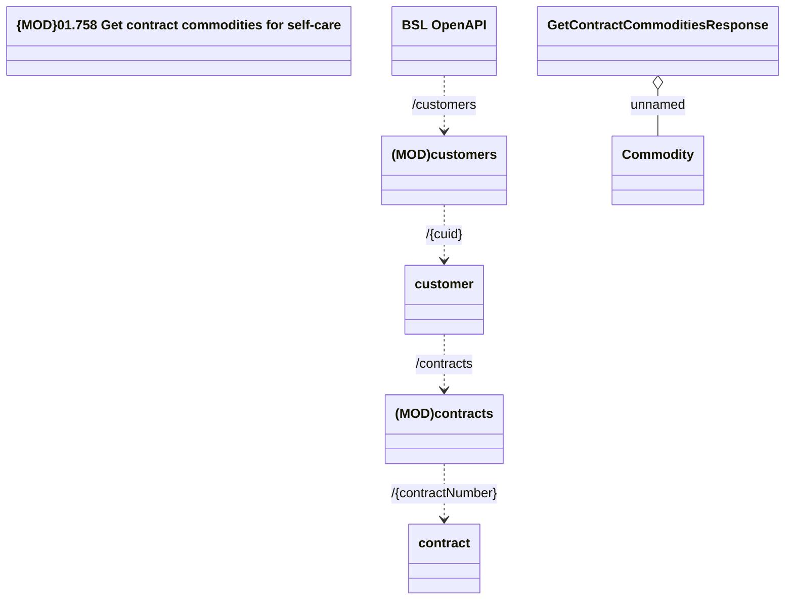

# Contract Commodities

- **Diagram Type**: Logical
- **Package**: HomerSelect/BSL/Analysis Model/Contract Management/Customer Self-Care API/Application Interface Model/CLM OpenAPI/Customers/v2.0/Contract Commodities
- **Diagram ID**: 159620
- **Elements**: 8
- **Connectors**: 7

