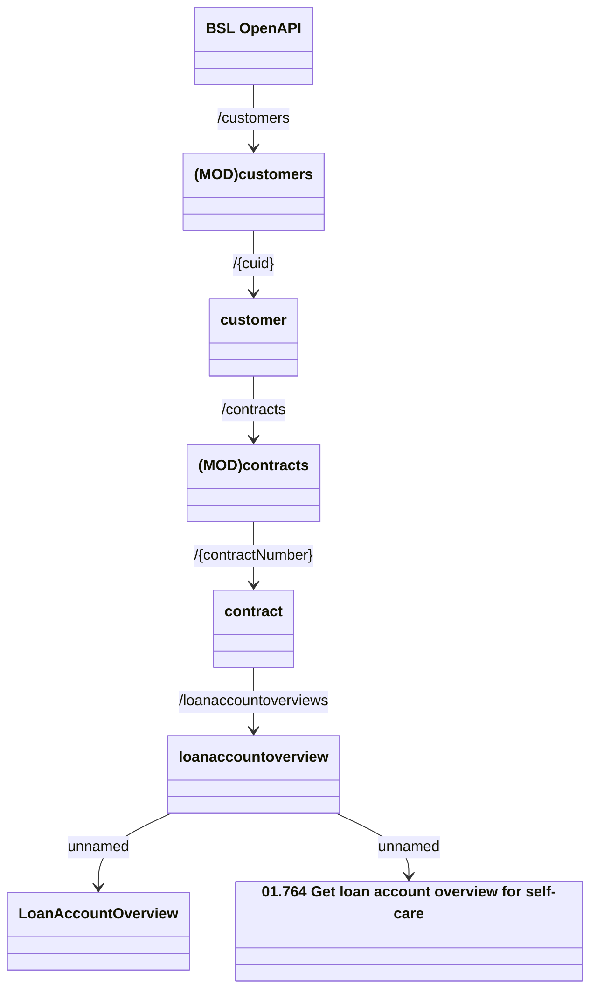

# Contract Loan Account Overview

```mermaid
classDiagram
    class MOD_contracts["(MOD)contracts"]
    class customer["customer"]
    class loanaccountoverview["loanaccountoverview"]
    class contract["contract"]
    class MOD_customers["(MOD)customers"]
    class BSL_OpenAPI["BSL OpenAPI"]
    class LoanAccountOverview["LoanAccountOverview"]
    class n_01_764_Get_loan_account_overview_for_self_care["01.764 Get loan account overview for self-care"]
    customer --> MOD_contracts : /contracts
    MOD_contracts --> contract : /{contractNumber}
    MOD_customers --> customer : /{cuid}
    contract --> loanaccountoverview : /loanaccountoverviews
    loanaccountoverview --> LoanAccountOverview : unnamed
    BSL_OpenAPI --> MOD_customers : /customers
    loanaccountoverview --> n_01_764_Get_loan_account_overview_for_self_care : unnamed
```
