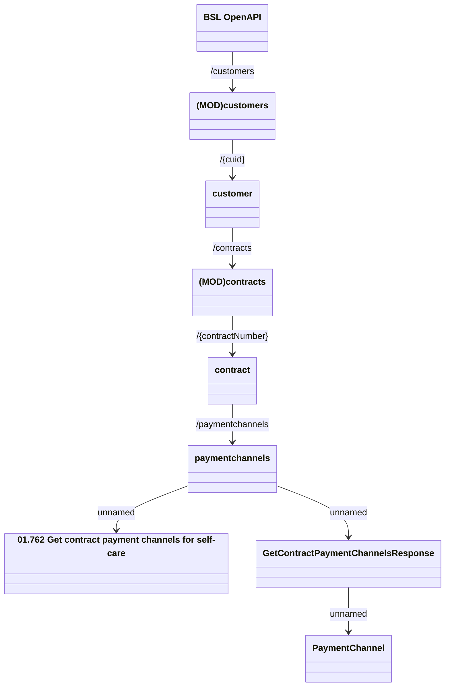

# Contract Payment Channels

```mermaid
classDiagram
    class MOD_contracts["(MOD)contracts"]
    class paymentchannels["paymentchannels"]
    class customer["customer"]
    class contract["contract"]
    class MOD_customers["(MOD)customers"]
    class BSL_OpenAPI["BSL OpenAPI"]
    class n_01_762_Get_contract_payment_channels_for_self_care["01.762 Get contract payment channels for self-care"]
    class GetContractPaymentChannelsResponse["GetContractPaymentChannelsResponse"]
    class PaymentChannel["PaymentChannel"]
    GetContractPaymentChannelsResponse --> PaymentChannel : unnamed
    customer --> MOD_contracts : /contracts
    MOD_contracts --> contract : /{contractNumber}
    contract --> paymentchannels : /paymentchannels
    paymentchannels --> GetContractPaymentChannelsResponse : unnamed
    MOD_customers --> customer : /{cuid}
    BSL_OpenAPI --> MOD_customers : /customers
    paymentchannels --> n_01_762_Get_contract_payment_channels_for_self_care : unnamed
```
