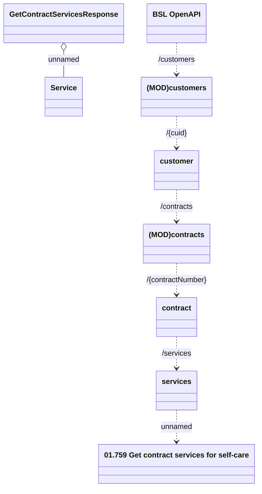

# Contract Services

- **Diagram Type**: Logical
- **Package**: HomerSelect/BSL/Analysis Model/Contract Management/Customer Self-Care API/Application Interface Model/CLM OpenAPI/Customers/v10.0/Contract Services
- **Diagram ID**: 159617
- **Elements**: 9
- **Connectors**: 7

