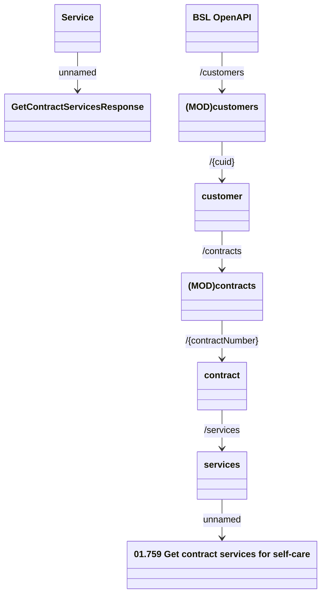

# Contract Services

```mermaid
classDiagram
    class Service["Service"]
    class GetContractServicesResponse["GetContractServicesResponse"]
    class n_01_759_Get_contract_services_for_self_care["01.759 Get contract services for self-care"]
    class services["services"]
    class customer["customer"]
    class MOD_customers["(MOD)customers"]
    class BSL_OpenAPI["BSL OpenAPI"]
    class contract["contract"]
    class MOD_contracts["(MOD)contracts"]
    Service --> GetContractServicesResponse : unnamed
    contract --> services : /services
    customer --> MOD_contracts : /contracts
    MOD_contracts --> contract : /{contractNumber}
    MOD_customers --> customer : /{cuid}
    BSL_OpenAPI --> MOD_customers : /customers
    services --> n_01_759_Get_contract_services_for_self_care : unnamed
```
