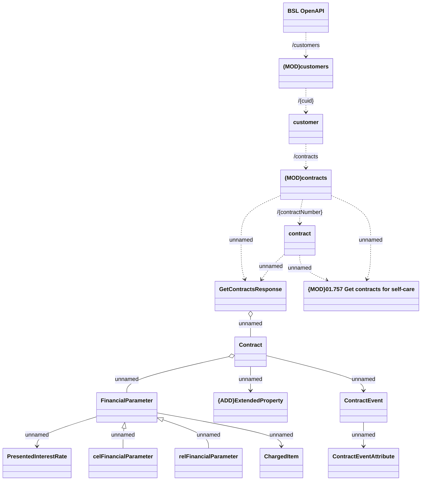

# Contracts/Contract

- **Diagram Type**: Logical
- **Package**: HomerSelect/BSL/Analysis Model/Contract Management/Customer Self-Care API/Application Interface Model/CLM OpenAPI/Customers/v10.0/Contracts/Contract
- **Diagram ID**: 159615
- **Elements**: 16
- **Connectors**: 17

