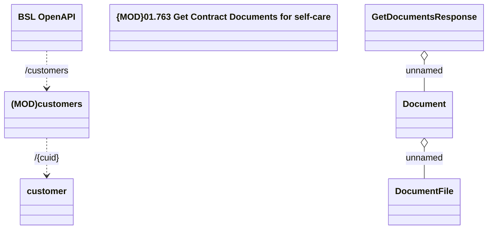

# Documents (DEPRECATED)

- **Diagram Type**: Logical
- **Package**: HomerSelect/BSL/Analysis Model/Contract Management/Customer Self-Care API/Application Interface Model/CLM OpenAPI/Customers/v1.0/Documents (DEPRECATED)
- **Diagram ID**: 159606
- **Elements**: 7
- **Connectors**: 6

