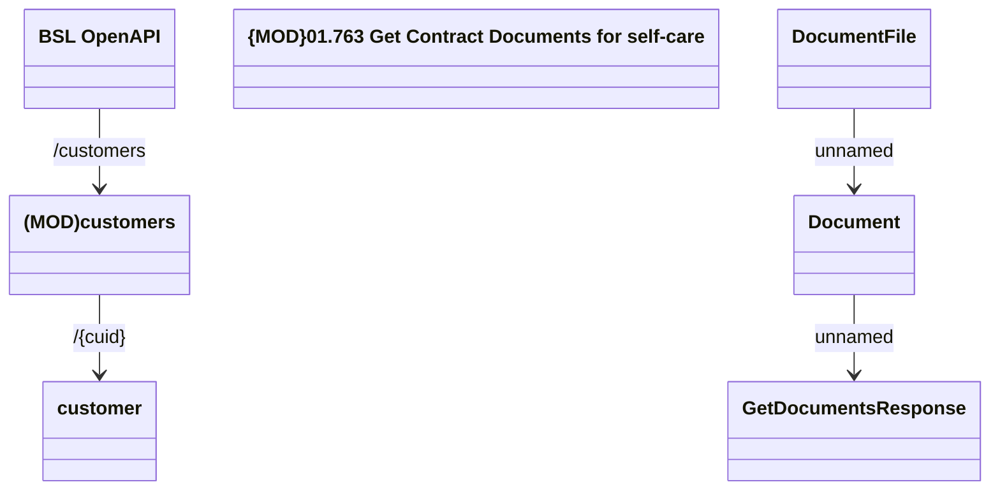

# Documents (DEPRECATED)

```mermaid
classDiagram
    class customer["customer"]
    class MOD_customers["(MOD)customers"]
    class BSL_OpenAPI["BSL OpenAPI"]
    class MOD_01_763_Get_Contract_Documents_for_self_care["{MOD}01.763 Get Contract Documents for self-care"]
    class DocumentFile["DocumentFile"]
    class GetDocumentsResponse["GetDocumentsResponse"]
    class Document["Document"]
    DocumentFile --> Document : unnamed
    Document --> GetDocumentsResponse : unnamed
    MOD_customers --> customer : /{cuid}
    BSL_OpenAPI --> MOD_customers : /customers
```
