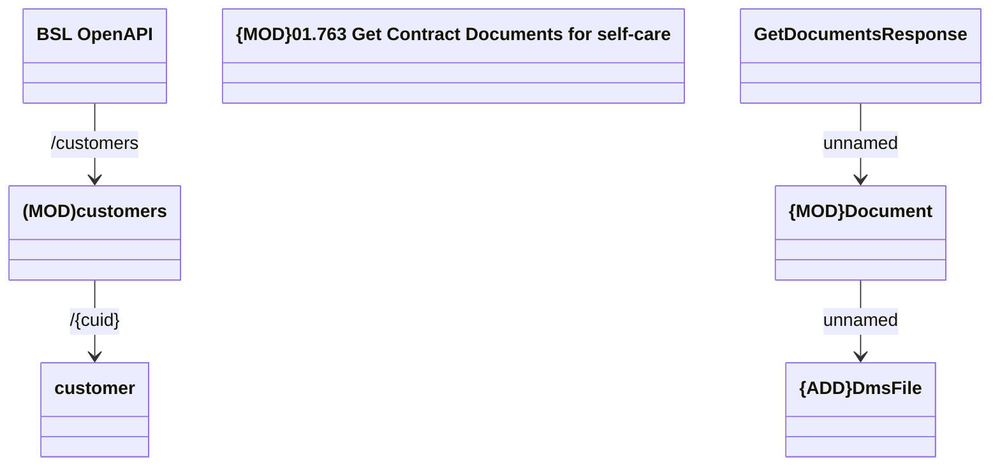

# Documents (NOT IMPLEMENTED)

```mermaid
classDiagram
    class customer["customer"]
    class MOD_customers["(MOD)customers"]
    class BSL_OpenAPI["BSL OpenAPI"]
    class MOD_01_763_Get_Contract_Documents_for_self_care["{MOD}01.763 Get Contract Documents for self-care"]
    class ADD_DmsFile["{ADD}DmsFile"]
    class GetDocumentsResponse["GetDocumentsResponse"]
    class MOD_Document["{MOD}Document"]
    GetDocumentsResponse --> MOD_Document : unnamed
    MOD_Document --> ADD_DmsFile : unnamed
    MOD_customers --> customer : /{cuid}
    BSL_OpenAPI --> MOD_customers : /customers
```
