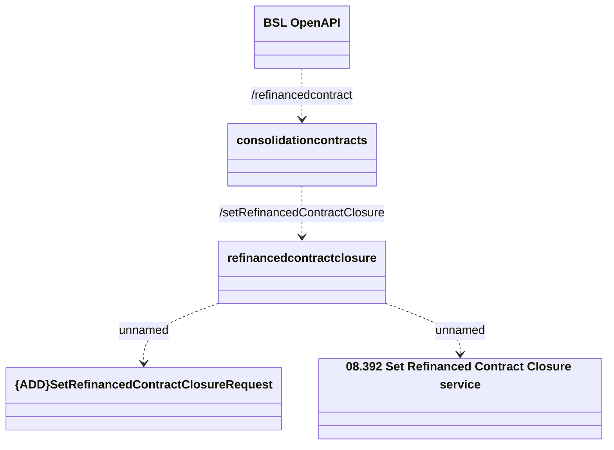

# Refinanced Contract Closure

- **Diagram Type**: Logical
- **Package**: HomerSelect/BSL/Analysis Model/Contract Management/Customer Self-Care API/Application Interface Model/CLM OpenAPI/Refinanced Contract/v1.0/Refinanced Contract Closure
- **Diagram ID**: 159600
- **Elements**: 5
- **Connectors**: 4

