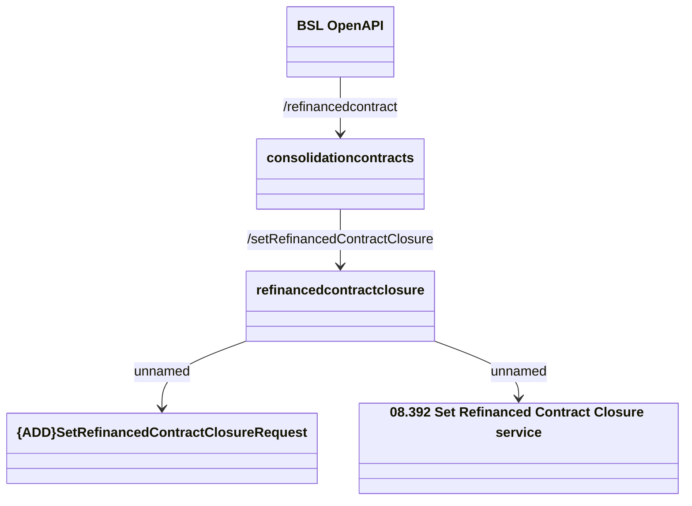

# Refinanced Contract Closure

```mermaid
classDiagram
    class refinancedcontractclosure["refinancedcontractclosure"]
    class consolidationcontracts["consolidationcontracts"]
    class BSL_OpenAPI["BSL OpenAPI"]
    class n_08_392_Set_Refinanced_Contract_Closure_service["08.392 Set Refinanced Contract Closure service"]
    class ADD_SetRefinancedContractClosureRequest["{ADD}SetRefinancedContractClosureRequest"]
    consolidationcontracts --> refinancedcontractclosure : /setRefinancedContractClosure
    BSL_OpenAPI --> consolidationcontracts : /refinancedcontract
    refinancedcontractclosure --> ADD_SetRefinancedContractClosureRequest : unnamed
    refinancedcontractclosure --> n_08_392_Set_Refinanced_Contract_Closure_service : unnamed
```
