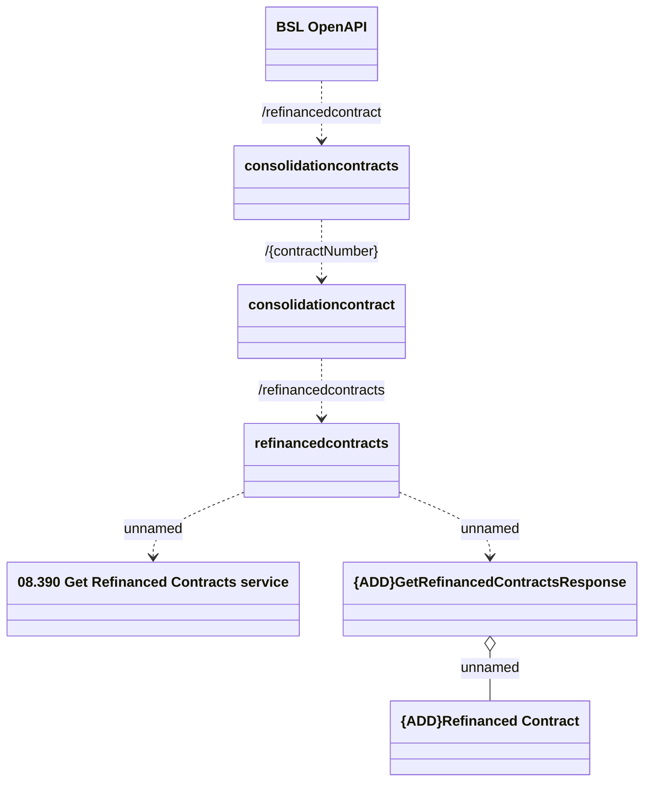

# Refinanced Contract

- **Diagram Type**: Logical
- **Package**: HomerSelect/BSL/Analysis Model/Contract Management/Customer Self-Care API/Application Interface Model/CLM OpenAPI/Refinanced Contract/v1.0/Refinanced Contracts
- **Diagram ID**: 159601
- **Elements**: 7
- **Connectors**: 6

