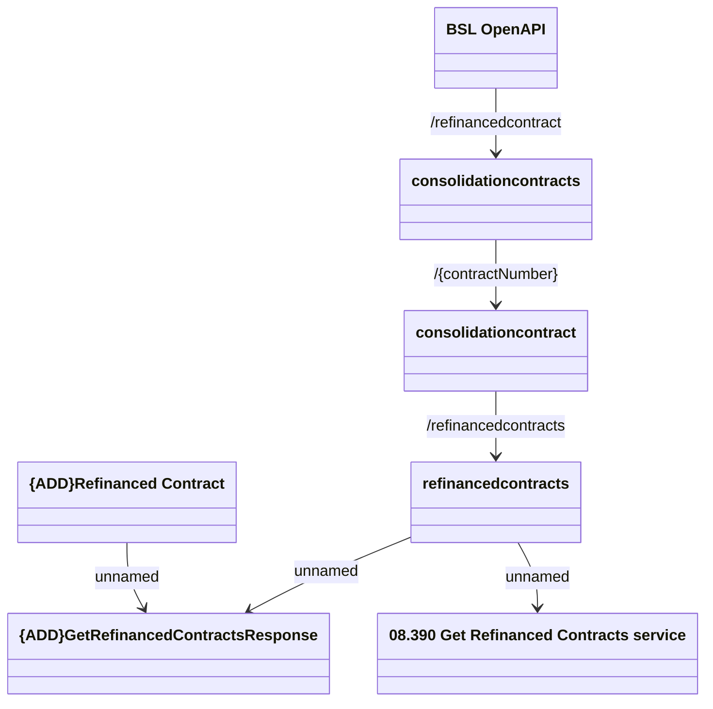

# Refinanced Contract

```mermaid
classDiagram
    class refinancedcontracts["refinancedcontracts"]
    class consolidationcontract["consolidationcontract"]
    class consolidationcontracts["consolidationcontracts"]
    class BSL_OpenAPI["BSL OpenAPI"]
    class n_08_390_Get_Refinanced_Contracts_service["08.390 Get Refinanced Contracts service"]
    class ADD_Refinanced_Contract["{ADD}Refinanced Contract"]
    class ADD_GetRefinancedContractsResponse["{ADD}GetRefinancedContractsResponse"]
    ADD_Refinanced_Contract --> ADD_GetRefinancedContractsResponse : unnamed
    consolidationcontracts --> consolidationcontract : /{contractNumber}
    BSL_OpenAPI --> consolidationcontracts : /refinancedcontract
    refinancedcontracts --> ADD_GetRefinancedContractsResponse : unnamed
    consolidationcontract --> refinancedcontracts : /refinancedcontracts
    refinancedcontracts --> n_08_390_Get_Refinanced_Contracts_service : unnamed
```
