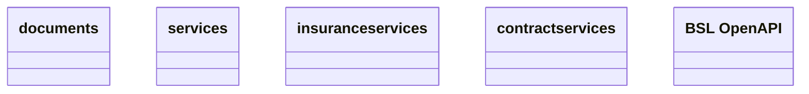

# CSI OpenAPI

- **Diagram Type**: Logical
- **Package**: HomerSelect/BSL/Analysis Model/Contract Management/Customer Self-Care API/Application Interface Model/CSI OpenAPI
- **Diagram ID**: 161858
- **Elements**: 5
- **Connectors**: 0

