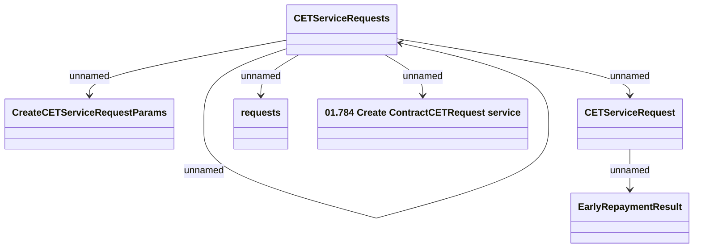

# Contract CET Service Requests - create request

```mermaid
classDiagram
    class CreateCETServiceRequestParams["CreateCETServiceRequestParams"]
    class CETServiceRequest["CETServiceRequest"]
    class EarlyRepaymentResult["EarlyRepaymentResult"]
    class CETServiceRequests["CETServiceRequests"]
    class CETServiceRequests["CETServiceRequests"]
    class requests["requests"]
    class n_01_784_Create_ContractCETRequest_service["01.784 Create ContractCETRequest service"]
    CETServiceRequests --> n_01_784_Create_ContractCETRequest_service : unnamed
    CETServiceRequests --> requests : unnamed
    CETServiceRequests --> CETServiceRequests : unnamed
    CETServiceRequest --> EarlyRepaymentResult : unnamed
    CETServiceRequests --> CETServiceRequest : unnamed
    CETServiceRequests --> CreateCETServiceRequestParams : unnamed
```
