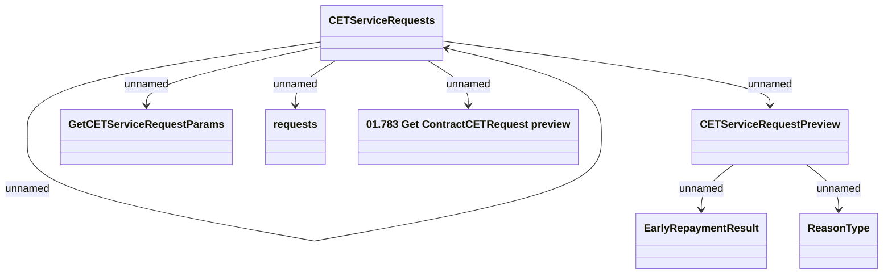

# Contract CET Service Requests - get preview

```mermaid
classDiagram
    class ReasonType["ReasonType"]
    class EarlyRepaymentResult["EarlyRepaymentResult"]
    class CETServiceRequestPreview["CETServiceRequestPreview"]
    class GetCETServiceRequestParams["GetCETServiceRequestParams"]
    class CETServiceRequests["CETServiceRequests"]
    class CETServiceRequests["CETServiceRequests"]
    class requests["requests"]
    class n_01_783_Get_ContractCETRequest_preview["01.783 Get ContractCETRequest preview"]
    CETServiceRequests --> n_01_783_Get_ContractCETRequest_preview : unnamed
    CETServiceRequests --> requests : unnamed
    CETServiceRequests --> CETServiceRequests : unnamed
    CETServiceRequests --> GetCETServiceRequestParams : unnamed
    CETServiceRequests --> CETServiceRequestPreview : unnamed
    CETServiceRequestPreview --> EarlyRepaymentResult : unnamed
    CETServiceRequestPreview --> ReasonType : unnamed
```
