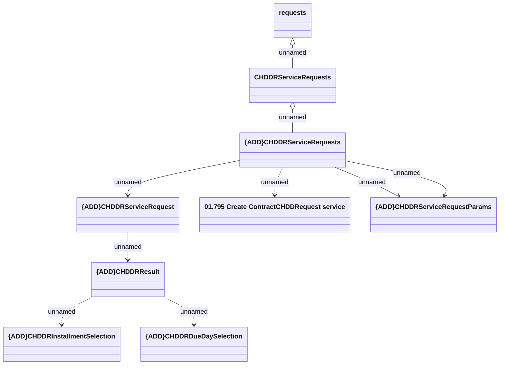

# Contract CHDDR Service Requests - create request

- **Diagram Type**: Logical
- **Package**: HomerSelect/BSL/Analysis Model/Contract Management/Customer Self-Care API/Application Interface Model/CSI OpenAPI/Contract Service Requests/Contract CHDDR Service Requests
- **Diagram ID**: 131789
- **Elements**: 9
- **Connectors**: 9

