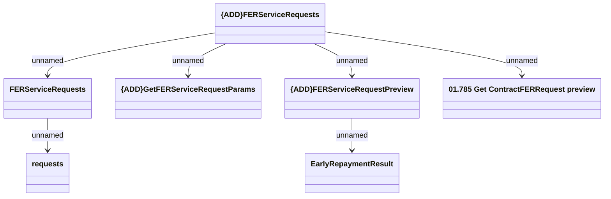

# Contract FER Service Requests - get preview

```mermaid
classDiagram
    class ADD_FERServiceRequestPreview["{ADD}FERServiceRequestPreview"]
    class ADD_GetFERServiceRequestParams["{ADD}GetFERServiceRequestParams"]
    class FERServiceRequests["FERServiceRequests"]
    class requests["requests"]
    class n_01_785_Get_ContractFERRequest_preview["01.785 Get ContractFERRequest preview"]
    class ADD_FERServiceRequests["{ADD}FERServiceRequests"]
    class EarlyRepaymentResult["EarlyRepaymentResult"]
    ADD_FERServiceRequestPreview --> EarlyRepaymentResult : unnamed
    ADD_FERServiceRequests --> n_01_785_Get_ContractFERRequest_preview : unnamed
    FERServiceRequests --> requests : unnamed
    ADD_FERServiceRequests --> FERServiceRequests : unnamed
    ADD_FERServiceRequests --> ADD_GetFERServiceRequestParams : unnamed
    ADD_FERServiceRequests --> ADD_FERServiceRequestPreview : unnamed
```
