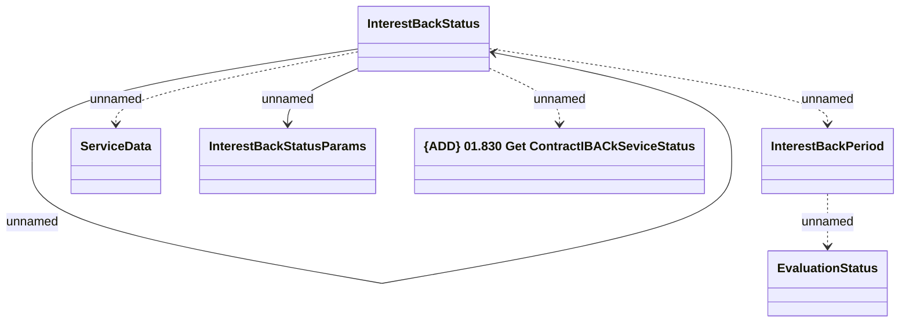

# Contract IBACK Service status

- **Diagram Type**: Logical
- **Package**: HomerSelect/BSL/Analysis Model/Contract Management/Customer Self-Care API/Application Interface Model/CSI OpenAPI/Contract Service Requests/Contract IBACK Service status
- **Diagram ID**: 163435
- **Elements**: 7
- **Connectors**: 6

