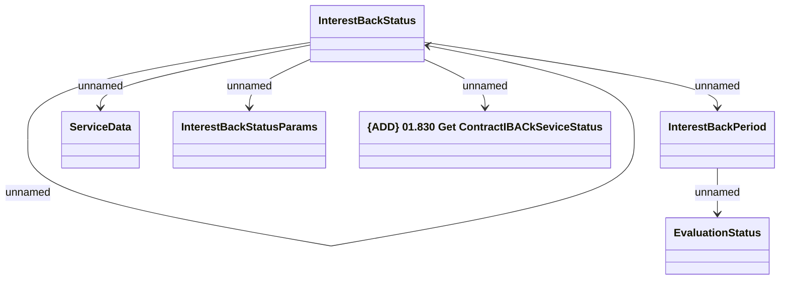

# Contract IBACK Service status

```mermaid
classDiagram
    class EvaluationStatus["EvaluationStatus"]
    class InterestBackPeriod["InterestBackPeriod"]
    class ServiceData["ServiceData"]
    class InterestBackStatus["InterestBackStatus"]
    class InterestBackStatusParams["InterestBackStatusParams"]
    class ADD_01_830_Get_ContractIBACkSeviceStatus["{ADD} 01.830 Get ContractIBACkSeviceStatus"]
    class InterestBackStatus["InterestBackStatus"]
    InterestBackStatus --> ADD_01_830_Get_ContractIBACkSeviceStatus : unnamed
    InterestBackStatus --> InterestBackStatusParams : unnamed
    InterestBackStatus --> InterestBackStatus : unnamed
    InterestBackStatus --> ServiceData : unnamed
    InterestBackStatus --> InterestBackPeriod : unnamed
    InterestBackPeriod --> EvaluationStatus : unnamed
```
